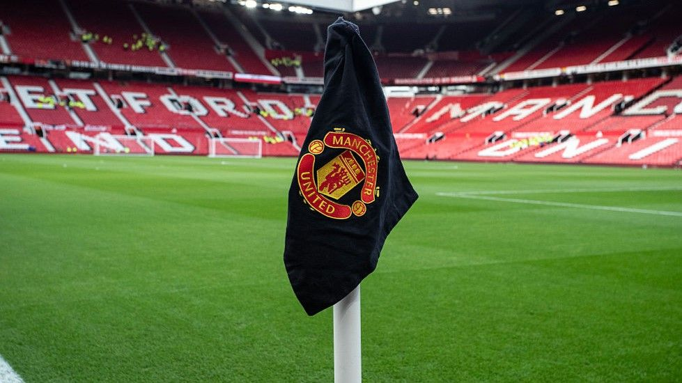
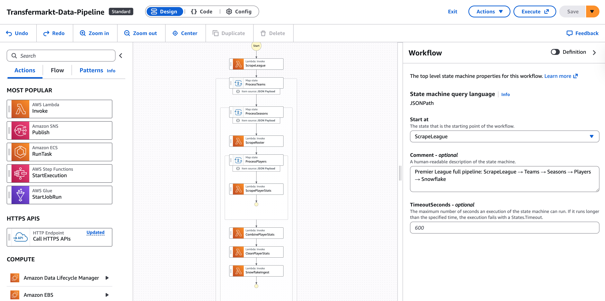
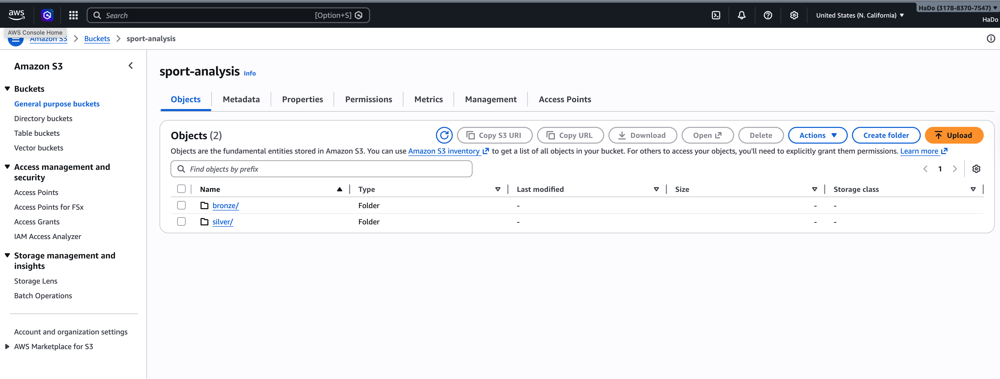
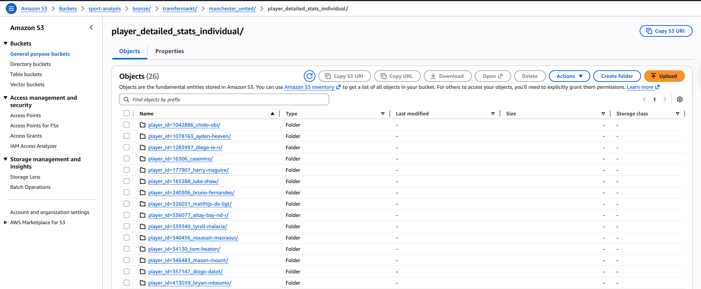
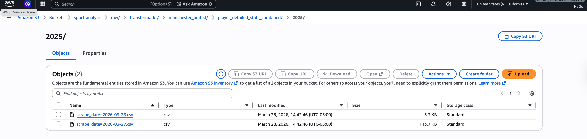
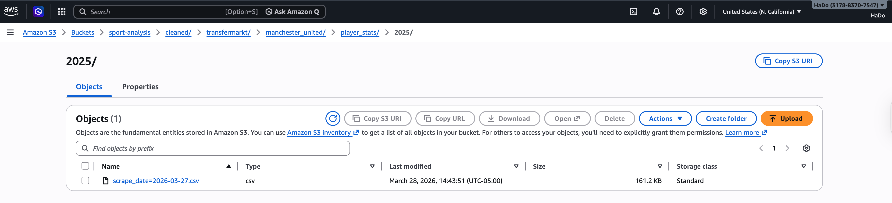

# Cloud-Native ETL Pipeline

Infrastructure-focused ETL pipeline for scraping and ingesting 1M+ records of Transfermarkt squad and player season data using AWS Lambda, S3, Step Functions, EventBridge Scheduler, Snowflake, and Terraform.

<div align="center">
  
</div>

## Badges


## Architecture

```text
Transfermarkt.com → scrape_roster → scrape_players → combine_player_json_to_csv → S3 Raw → clean-player-stats → S3 Cleaned → snowflake-ingest → Snowflake Bronze
```

## AWS Services

- **Compute**: AWS Lambda for scraping, aggregation, cleaning, and Snowflake ingesting
- **Storage**: S3 for raw and cleaned data
- **Orchestration**: Step Functions for workflow sequencing
- **Scheduling**: EventBridge Scheduler for triggering the Step Functions workflow on a weekly schedule
- **Data Warehouse**: Snowflake (my free credits on Redshift is running out)
- **Infrastructure as Code**: Terraform for Lambdas, IAM, Step Functions, and Scheduler configuration

## Step Functions Orchestration

AWS Step Functions orchestrates the pipeline so each Lambda stays focused on one job while the workflow layer handles sequencing and coordination.

- The state machine starts with roster scraping.
- A `Map` state fans out player scraping in parallel from the roster output.
- Once player-level raw snapshots are complete, the workflow triggers the combine step, the cleaner step, and finally the Snowflake ingest step.
- This keeps retry logic, execution history, and parallel control outside the Lambda code itself.



The execution view makes it easier to observe which stage ran, which player-level branches succeeded, and where a retry is needed.


## Execution Flow

1. **Roster ingestion** (`scrape_roster_handler.handler`) - Scrapes squad roster
2. **Player ingestion** (`scrape_players_handler.handler`) - Scrapes individual player'stats who exists in roster
3. **Bronze aggregation** (`combine_player_json_to_csv_handler.handler`) - Combines player snapshots to CSV
4. **Cleaned transformation** - Cleanses raw data for warehouse loading
5. **Snowflake ingestion** (`snowflake_ingest_handler.handler`) - Loads cleaned S3 snapshots into Snowflake staging and bronze layers

## Storage Layout

Data is date-partitioned by **season + team + scrape_date**, organized into two S3 prefixes, `raw/` and `cleaned/`:

```text
s3://<your-bucket-name>/
  raw/
    transfermarkt/
      manchester_united/
            player_detailed_stats_individual/
              player_id=177907_harry-maguire/
                2025/ #season
                  scrape_date=2026-03-27.json
            team_roster/
              2025/ #season
                scrape_date=2026-03-27.json
            player_detailed_stats_combined_20240115.csv
              2025/ #season
                scrape_date=2026-03-27.csv
      ...
  cleaned/
    transfermarkt/
      manchester_united/
        player_stats/
          2025/
            scrape_date=2026-03-26.csv
      ...
```

S3 is split into  
- `raw/`: keeps append-only snapshots for replay and debugging
- `cleaned/`: keeps the output that is ready to load into a warehouse.



Each scrape run writes raw JSON files by team, player, season, and scrape date.



The scraper also writes a combined raw CSV containing all player stats for that scrape date at team-season granularity.


The cleaned layer is ready for warehouse ingestion.



## Local Operations

Whenever you want to discover, test run, debug for 1 specific event or functionality, use the single CLI entrypoint [`scripts/run_local.py`](scripts/run_local.py). It covers league discovery, one-team runs, full backfills, cleaning, S3 upload, and Snowflake ingest.

Common local commands:

```bash
python3 scripts/run_local.py --help
python3 scripts/run_local.py league --league-id GB1 --seasons 2025
python3 scripts/run_local.py team --team manchester_united --season 2025
python3 scripts/run_local.py clean --team manchester_united --season 2025 --scrape-date 2026-03-30
python3 scripts/run_local.py upload --team manchester_united --season 2025 --bucket <your-bucket-name>
python3 scripts/run_local.py ingest --team manchester_united --season 2025 --scrape-date 2026-03-30
```

### Backfill Strategy

For the initial load, treat the job as a bulk backfill, the cli would be:

```bash
python3 scripts/run_local.py backfill \
  --league-id GB1 \
  --seasons 2021 2022 2023 2024 2025 \
  --competition GB1 \
  --bucket <your-bucket-name>
```

Local-only backfill without S3 upload or Snowflake ingest:

```bash
python3 scripts/run_local.py backfill \
  --league-id GB1 \
  --seasons 2021 2022 2023 2024 2025 \
  --competition GB1 \
  --skip-upload \
  --skip-ingest
```

This keeps historical runs reproducible without forcing the main Step Functions path to handle the full one-time backfill workload.

## Lambda Deployment

### Active Lambda Functions

These are the Lambda functions currently used in AWS for this project, along with the handler each one maps to:

| Lambda function | Handler |
| --- | --- |
| `scrape-roster` | `scrape_roster_handler.handler` |
| `scrape-players` | `scrape_players_handler.handler` |
| `combine-player-json` | `combine_player_json_to_csv_handler.handler` |
| `clean-player-stats` | `clean_player_stats_handler.handler` |
| `snowflake-ingest` | `snowflake_ingest_handler.handler` |

### 1. Build Lambda artifacts

There are many ways to build a lambda function. What I am doing is trying to deploy local code into lambda functions accordingly, so we ensure the concistency between local dev and production code. 

Use [`build_lambda.sh`](build_lambda.sh) from the project root to package each Lambda function:

```bash
./build_lambda.sh scrape-roster scrape_roster_handler.py
./build_lambda.sh scrape-players scrape_players_handler.py
./build_lambda.sh combine-player-json combine_player_json_to_csv_handler.py
./build_lambda.sh clean-player-stats clean_player_stats_handler.py
./build_lambda.sh snowflake-ingest snowflake_ingest_handler.py
```

Each build command creates a deployment zip that contains:

- `src/`
- `utils/`
- the selected handler from `lambda_deployment/`
- dependencies from `requirements.txt`

The output files are written to the repo root as:

```text
scrape-roster.zip
scrape-players.zip
combine-player-json.zip
clean-player-stats.zip
snowflake-ingest.zip
```

## Terraform Infrastructure

Terraform provisions all AWS resources for the pipeline: Lambda functions, IAM roles, Step Functions state machine, and EventBridge Scheduler. This keeps infrastructure as code, making deployments repeatable and changes/updates trackable for out AWS Infrastructure.


Current Terraform scope:

- `iam.tf`: least-privilege IAM for `dev_lamda`
- `lambdas.tf`: the five pipeline Lambdas and their runtime configuration
- `step_functions.tf`: the `Transfermarkt-Data-Pipeline` state machine and its dedicated role
- `eventbridge.tf`: the weekly EventBridge Scheduler trigger and its dedicated role
- `step_functions/pipeline.json`: externalized state machine definition loaded with `templatefile()`

Typical Terraform flow:

```bash
cd terraform
terraform init
terraform plan
terraform apply
```

The Lambda deployment zips are still required to be built from the repo root before Terraform applies code updates:

### 2. Create a Lambda function for the first time

If the Lambda does not exist yet in AWS, create it first. Example for the cleaner Lambda:

```bash
aws lambda create-function \
  --function-name clean-player-stats \
  --runtime python3.11 \
  --role arn:aws:iam::<account-id>:role/<lambda-execution-role> \
  --handler clean_player_stats_handler.handler \
  --zip-file fileb://clean-player-stats.zip \
  --timeout 300 \
  --memory-size 256 \
  --environment "Variables={S3_BUCKET=<your-bucket-name>,S3_RAW_PREFIX=raw,S3_CLEANED_PREFIX=cleaned}"
```

For the other functions, keep the same structure and change:

- `--function-name`
- `--handler`
- `--zip-file`

### 3. Update Lambda code after the function already exists

Once a Lambda function has already been created, update only its code package with:

```bash
aws lambda update-function-code \
  --function-name scrape-roster \
  --zip-file fileb://scrape-roster.zip

aws lambda update-function-code \
  --function-name scrape-players \
  --zip-file fileb://scrape-players.zip

aws lambda update-function-code \
  --function-name combine-player-json \
  --zip-file fileb://combine-player-json.zip

aws lambda update-function-code \
  --function-name clean-player-stats \
  --zip-file fileb://clean-player-stats.zip

aws lambda update-function-code \
  --function-name snowflake-ingest \
  --zip-file fileb://snowflake-ingest.zip
```

> **Note:** 
- `aws lambda update-function-code` only works for functions that already exist. Always run the build step before either `create-function` or `update-function-code`.
-  For `clean-player-stats` lambda, I manually add Numpy package on the layer on the UI to avoid the mismatch between OS and Linux installation (and I dont want to use Docker for this yet)
- For `snowflake-ingest`, I currently prefer running ingestion locally or from CloudShell unless the Snowflake dependency layer is fully set up in Lambda.
- For day-to-day infrastructure changes, Terraform is now the preferred path over manual console edits.

## Scraping and Storage Strategy

### Configuration-driven scrape control

The project uses [`utils/config.py`](utils/config.py) as the central place to control scrape scope. Think of it as a remote for your tv or a filter search which allows you to find data you want to scrape 

- To scrape a different team, we add or update an entry in `TEAM_CONFIGS`.
- To extend historical coverage for backfills, we expand `SEASONS` and `SEASON_LABELS` 
- For local operation, use the single entrypoint [`scripts/run_local.py`](scripts/run_local.py). It exposes subcommands for league discovery, one-team runs, backfills, cleaning, uploading, and Snowflake ingest.

This keeps the handlers and scripts generic and modular. The scraping code stays focused on execution logic.

### Raw layer design

- Raw is the system of record for scrape outputs.
- Every run writes a new object under a `scrape_date=...` path.
- Existing snapshots are not overwritten.

This makes the pipeline idempotent in practice: rerunning a scrape does not corrupt prior outputs or require cleanup before trying again. Instead, each run creates a new dated snapshot that can be compared, replayed, or ignored downstream if needed.

### Why the partitions are chosen this way

- `team` separates club-level datasets.
- `artifact` separates roster, individual player stats, and combined player stats.
- `player_id` exists only for the individual raw area because that is the natural unit of scrape and retry.
- `season` keeps historical runs bounded to a specific season.
- `scrape_date` identifies the exact extraction run.

That partitioning matches the main operational questions:

- "Can I rerun one player without touching everyone else?"
- "Can I rebuild the combined CSV for one season and one scrape date?"
- "Can I backfill older seasons without overwriting the latest run?"
- "Can downstream jobs load a known snapshot deterministically?"

### Why not store one big CSV per league-season

Someone might wonder why the pipeline does not write one single raw file for every league and season. Evn though this design simpler , but it is not the best fit for scraping, retries, and later ingestion.

- A single league-season CSV has a larger failure blast radius. If one club or one player scrape fails, the whole file becomes incomplete and must be regenerated.
- Granular storage is more idempotent. Re-scraping one team or one player writes a new snapshot for only that slice instead of forcing a rewrite of the full league file.
- Backfills are cheaper and safer. You can rerun one team, one season, or one scrape date without touching the rest of the league. Therefore, debugging is easier and much faster to inspect one team or player prefix than to search inside one very large CSV.
- Ingestion is more flexible. Downstream jobs can load only the partitions that changed instead of reloading an entire league-season every time.

## Whats coming next?
- Expand scope to scrape all team within 5 most common league: expect 5 million+ row of data.
- Transform data and visualization with dbt, might be in another folder