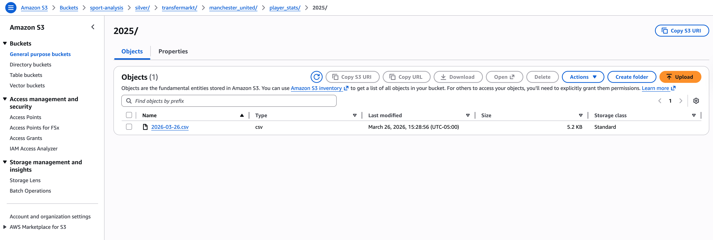

# Cloud-Native ETL Pipeline

Infrastructure-focused ETL pipeline for Transfermarkt squad and player season data using AWS Lambda, S3, and Step Functions.

<div align="center">
  
</div>

## Badges


## Architecture

```text
Transfermarkt.com → scrape_roster → scrape_players → combine_player_json_to_csv → S3 Bronze → Cleaner → S3 Silver
```

## AWS Services

- **Compute**: AWS Lambda for scraping, aggregation, and light cleaning
- **Storage**: S3 for bronze (raw) and silver (cleaned) data
- **Orchestration**: Step Functions for workflow sequencing
- **Model**: Stateless Lambdas, append-only bronze, immutable silver outputs

## Execution Flow

1. **Roster ingestion** (`scrape_roster_handler.handler`) - Scrapes squad roster
2. **Player ingestion** (`scrape_players_handler.handler`) - Scrapes individual player'stats who exists in roster
3. **Bronze aggregation** (`combine_player_json_to_csv_handler.handler`) - Combines player snapshots to CSV
4. **Silver transformation** - Cleanses bronze data for warehouse loading

## Storage Layout

Data is date-partitioned by **season + team + scrape_date**, organized into two folders, Broze and Silver:

```text
s3://sport-analysis/
  bronze/
    transfermarkt/
      manchester_united/
            player_detailed_stats_individual/
              player_id=177907_harry-maguire/
                2025/ #season
                  scrape_date=2026-03-27.json
            team_roster/
              2025/ #season
                scrape_date=2026-03-27.json
            player_detailed_stats_combined_20240115.csv
              2025/ #season
                scrape_date=2026-03-27.csv
      ...
  silver/
    transfermarkt/
      manchester_united/
        2025/
          2026-03-26.csv
      ...
```

S3 is split into `bronze/` and `silver/`: Bronze keeps raw, append-only snapshots for replay and debugging, while Silver keeps the cleaned output that is ready to load into a warehouse.


Each time scraper run, it would directly write jsons file for each team -> each player -> each season for the date of scraping


The scraper also writes a combined raw CSV containing all player stats for this scraping date at team-season granularity.


Silver is cleaned and ready for Datawarehouse ingestion


## Quick Start

```bash
python3 -m venv .venv && source .venv/bin/activate
python3 -m pip install -r requirements.txt
make test
python scripts/run_local_scrape_all.py --team manchester_united --season 2025
python scripts/run_local_clean_player_stats.py --team manchester_united --season 2025
./build_lambda.sh scrape-players scrape_players_handler.py
aws lambda update-function-code --function-name scrape-players --zip-file fileb://scrape-players.zip
```

## Scraping and Storage Strategy

### Configuration-driven scrape control

The project uses [`utils/config.py`](utils/config.py) as the central place to control scrape scope. Think of it as a remote for your tv or a filter search which allows you to find data you want to scrape 

- To scrape a different team, we add or update an entry in `TEAM_CONFIGS`.
- To extend historical coverage for backfills, we expand `SEASONS` and `SEASON_LABELS` 

This keeps the handlers and scripts generic and modular. The scraping code stays focused on execution logic.

### Bronze layer design

- Bronze is the raw system of record.
- Every run writes a new object under a `scrape_date=...` path.
- Existing snapshots are not overwritten.

This makes the pipeline idempotent in practice: rerunning a scrape does not corrupt prior outputs or require cleanup before trying again. Instead, each run creates a new dated snapshot that can be compared, replayed, or ignored downstream if needed.

### Why the partitions are chosen this way

- `team` separates club-level datasets.
- `artifact` separates roster, individual player stats, and combined player stats.
- `player_id` exists only for the individual bronze area because that is the natural unit of scrape and retry.
- `season` keeps historical runs bounded to a specific season.
- `scrape_date` identifies the exact extraction run.

That partitioning matches the main operational questions:

- "Can I rerun one player without touching everyone else?"
- "Can I rebuild the combined CSV for one season and one scrape date?"
- "Can I backfill older seasons without overwriting the latest run?"
- "Can downstream jobs load a known snapshot deterministically?"


### Backfill strategy

For the initial load, we treat the job as a bulk backfill. We define the historical seasons in `Config.SEASONS`, then run the local end-to-end scrape flow season by season so each run produces its own dated bronze snapshot and corresponding silver output.

```bash
python scripts/run_local_scrape_all.py --team manchester_united
```

With `SEASONS` set to the last 5 years, that gives one controlled historical load without overwriting newer runs.


## Whats coming next?
- Expand scope to scrape all team within 5 most common league: expect 1 million+ row of data
- Finish the ingestion part to datawarehouse
- Transform data and visualization